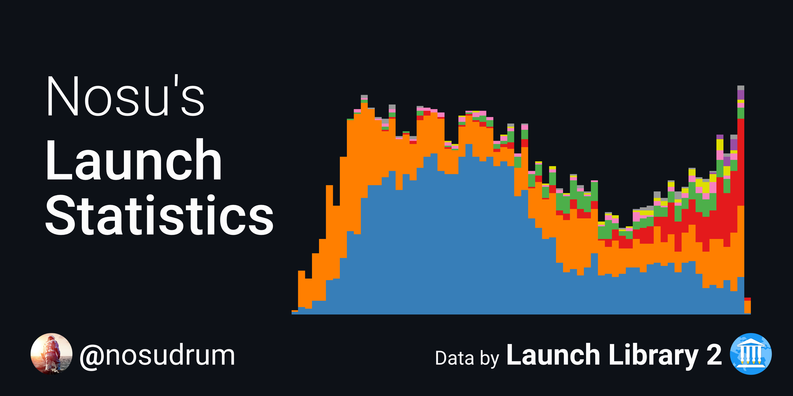

<!-- ## Hi there 👋 -->

## Welcome 

👋 Hi there! I'm Arnaud, a French (but European by heart) student passionate about space, technology, engineering and a lot of other stuff.

👨‍🎓 After doing a BSc and MSc in Mechanical Engineering at EPFL, with one year of exchange in Aerospace Engineering at TU Delft, I am now doing a double-degree in Aerospace Engineering at ISAE-Supaéro.

💻 Outside of my studies, you will can find me heavily invested in [The Space Devs](https://thespacedevs.com) 🛰️ as a core staff member for the [Launch Library 2](https://thespacedevs.com/llapi) 🚀 and [Spaceflight News](https://thespacedevs.com/snapi) 📰 APIs.

Finally, in no particular order, I like :
- Trains
- Nuclear power
- European cooperation
- Vector design
- Videogames & custom PCs
- Films & music (how original)

## 👩‍💻 Links

You can find me on [LinkedIn](https://www.linkedin.com/in/arnaud-muller-50b798138/), [Twitter](https://twitter.com/Nosudrum), <a rel="me" href="https://spacey.space/@nosu">Mastodon</a>, [Discord](https://discord.com/users/185822873913393153), [Reddit](https://www.reddit.com/user/Nosudrum), [Steam](https://steamcommunity.com/id/Nosudrum/).

Do check out the work I do over in my [launch-stats](https://github.com/nosudrum/launch-stats) repository. The plots are nice to have a quick look at, regardless of your interest in the topic :) 

Other projects I am invested in : [Go4Liftoff](https://go4liftoff.com), [Space Launch Now](https://spacelaunchnow.me).

## 🍿 Fun facts

In no particular order :
- I track all my train trips, with some plans to use the data in the future 👀
- I have lived in three different european countries
- I have watched Interstellar way too many times

  <a href="https://github.com/Nosudrum/launch-stats">
   

